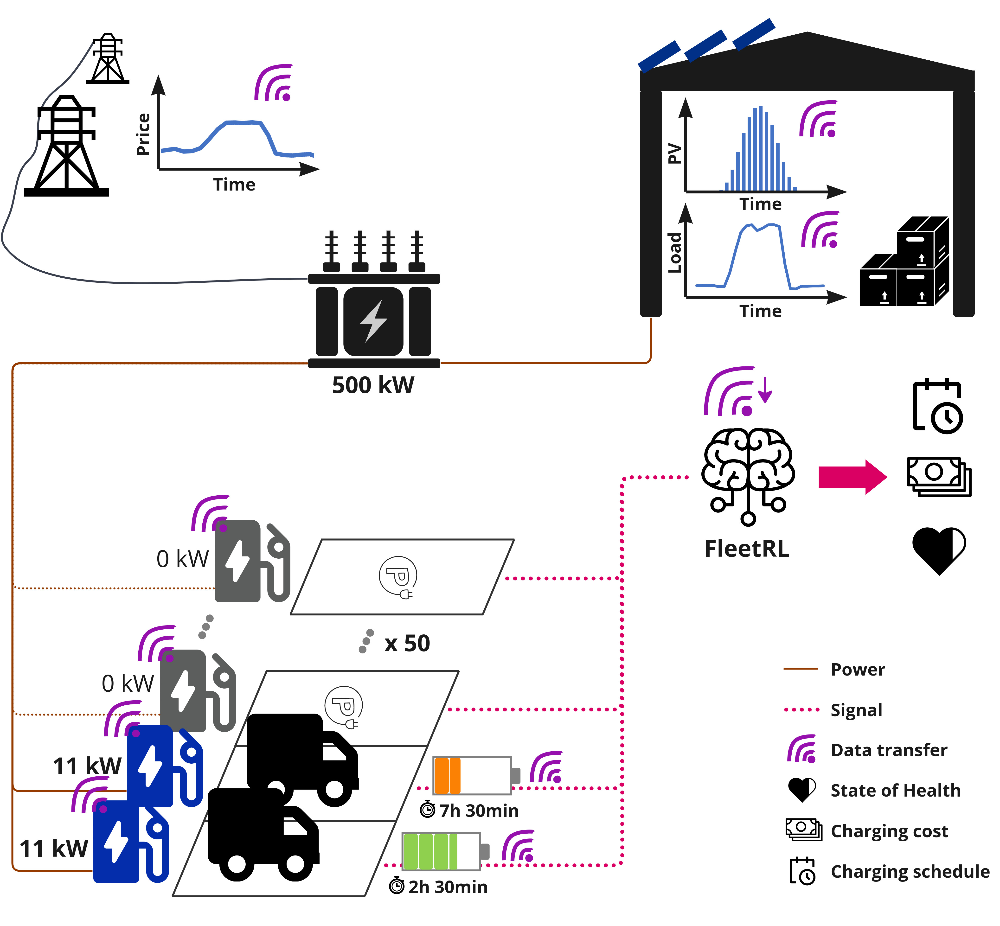

.. _overview:

Overview
===========

FleetRL is a Reinforcement Learning (RL) environment for EV charging optimization with a special focus on commercial
vehicle fleets. Its main function is the modelling of real-world charging processes. FleetRL was
developed with a modular approach, keeping in mind that improvements and additions are important to maintain
the value of this framework. Emphasis was therefore laid on readability, ease of use and ease of maintenance.
For example, the base-derived class architecture was used throughout the framework, allowing for easy interchangeability
of modules such as battery degradation.

Emphasis was also laid on customizability: own schedules can be generated, electricity prices can be switched by
changing a csv file, episode length, time resolution, and EV charging-specific parameters can be changed in their
respective config files.

**Physical model**

As seen in the graphic below, the physical scope currently includes the EVs, the building (load + PV), a
limited grid connection, and electricity prices (both for purchase and feed-in).

The EVs have probabilistic schedules that are generated beforehand. The main objective is thereby to minimize
charging cost while respecting the constraints of the schedules, grid connection and SOC requirements. Battery
degradation is modelled, both linearly and non-linearly. Electricity prices are taken from the EPEX spot market.
PV production data is taken from the MERRA-2 open data set, available `here <https://www.renewables.ninja>`_. Building
load was taken from the `NREL TMY-3 dataset <https://doi.org/10.25984/1876417>`_.

Some assumptions are taken to limit the degree of complexity of the optimization problem:

 * All connections are three-phase, and load imbalance is not considered.
 * Only active power is considered when calculating transformer loading. Capacitive and inductive properties of electrical equipment are not considered.
 * Although bidirectional charging is enabled, it only allows for energy arbitrage. Frequency regulation is not implemented in this study.
 * The companies are modelled as price takers and are assumed not to influence the electricity price with their demand.
 * Battery degradation is modelled non-linearly, taking into account rainflow cycle-counting and SEI-film formation according to `Xu et al. <https://doi.org/10.1109/TSG.2016.2578950>`_.

**Code structure**

FleetRL is based on the OpenAI / farama foundation gym framework and "basically" implements the step, reset, and init functions.
To train RL agents, the stable-baselines3 framework is used due to its high-quality implementations, level of maintenance
and documentation. Different agents can be plugged into the environment plug-and-play, only having to change
a few lines of code.

To train RL agents on a FleetRL environment, an env object needs to be created, which inherits from gym
and implements the necessary methods and the entire logic of the EV charging problem. The implementation can
be found under ``FleetRL.fleet_env.fleet_environment``. As can be seen, functions such as EV charging, or calculating
battery degradation are outsourced to separate modules to maintain readability. This way, a submodule can also
be changed without having to touch the main logic of the code.

**Leveraging base-derived class architecture**

FleetRL makes use of parent classes and sub-classes that implement the methods of the parent class - this
is also known as a base-derived hierarchy. For example, FleetRL uses ``time_picker`` to pick a starting date
for a new episode. This can either be random, or always the same date. A parent class ``TimePicker`` thereby
exists:

.. code-block:: python

    class TimePicker:
        def choose_time(self, db: pd.Series, freq: str, end_cutoff: int) -> Timestamp:
            """
            Parent class for time picker objects
            :param db: dataframe from env
            :param freq: frequency specification string for pandas
            :param end_cutoff: amount of days cut off at the end to allow some buffer. In the eval time picker case,
            the end cutoff specifies the size of the validation set.
            :return: A chosen time stamp
            """
            raise NotImplementedError("This is an abstract class.")

As can be seen, it dictates the inputs and outputs, as well as the methods the class contains -> these
must be matching exactly when implementing a sub-class of ``TimePicker``. The parent class methods cannot
be called directly, this would raise a ``NotImplementedError``.

A sub-class is implemented as follows, taking the example of the ``StaticTimePicker``:

.. code-block:: python

    from FleetRL.utils.time_picker.time_picker import TimePicker

    class StaticTimePicker(TimePicker):
        """
        Picks a static / always the same starting time.
        """

        def __init__(self, start_time: str = "01/01/2020 15:00"):
            """
            :param start_time: When initialised, start time is specified
            """
            self.start_time = start_time

        def choose_time(self, db: pd.Series, freq: str, end_cutoff: int) -> Timestamp:
            chosen_start_time = pd.to_datetime(self.start_time)
            # return start time
            return chosen_start_time

As can be seen, ``StaticTimePicker`` inherits from ``TimePicker``, and implements its methods. In the code,
an object of the type  ``TimePicker`` can then be created as follows:

.. code-block:: python

    tp: TimePicker = StaticTimePicker()

If a different time picker should be chosen, it can be changed by changing one line of code. In this
case, the ``RandomTimePicker`` is chosen instead:

.. code-block:: python

    tp: TimePicker = RandomTimePicker()

.. note::

    This is already automated in FleetRL, and the right time picker module can be specified via a string
    in the input parameters when creating an env object.

.. note::

    When writing an own sub-class, it must be ensured that all methods are implemented, and that the methods
    follow the same inputs/outputs as the parent class. Once this is done, the own implementation can be used
    in FleetRL by changing one line of code, as shown above.